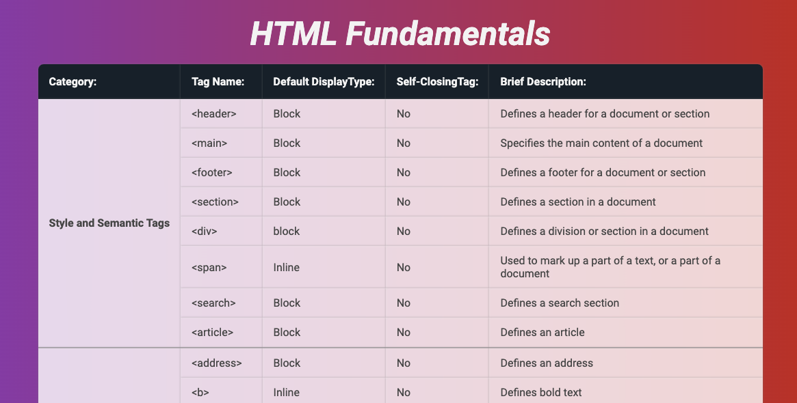

# HTML Table of HTML Fundamentals

This project provides a table that outlines various HTML tags and their properties. The table is styled using custom CSS, featuring design with gradients, rounded corners, and a modern look.

The project was a group exercise at Høyskolen Kristiania, where we collaborated on the HTML structure, and I was responsible for the CSS styling.

[Published HTML Table](https://sbraende-html-tags-table.netlify.app/)

